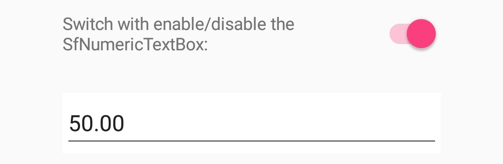
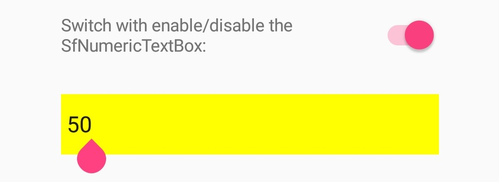
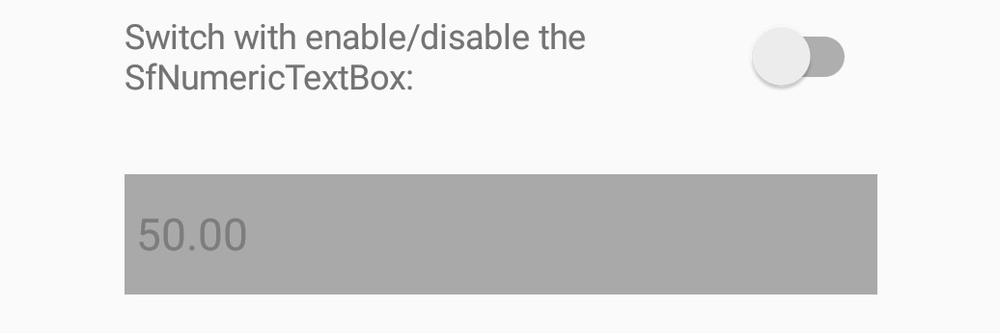

# How-to-change-the-Xamarin.Forms-numeric-textbox-style-using-its-visual-states

This article explains how to customize the Syncfusion Xamarin.Forms numeric text box control using visual states.

Let’s have a use case to keep default styles with having different background color which is varying based on its visual states if then Xamarin.Forms numeric text box control allows to do that with the help of global styles in Xamarin.Forms as per in below code snippet.

[App.xaml]

```
   …    

<Application.Resources>
        <ResourceDictionary>
            <Style x:Key="NumericTextBoxStyle" TargetType="numeric:SfNumericTextBox">
                <Setter Property="VisualStateManager.VisualStateGroups">
                    <VisualStateGroupList>
                        <VisualStateGroup x:Name="CommonStates">
                            <VisualState x:Name="Normal">
                                <VisualState.Setters>
                                    <Setter Property="BackgroundColor" Value="White" />
                                </VisualState.Setters>
                            </VisualState>
                            <VisualState x:Name="Disabled">
                                <VisualState.Setters>
                                    <Setter Property="BackgroundColor" Value="DarkGray" />
                                </VisualState.Setters>
                            </VisualState>
                            <VisualState x:Name="Focused">
                                <VisualState.Setters>
                                    <Setter Property="BackgroundColor" Value="Yellow" />
                                </VisualState.Setters>
                            </VisualState>
                        </VisualStateGroup>
                    </VisualStateGroupList>
                </Setter>
            </Style>
        </ResourceDictionary>
    </Application.Resources>

   …
```   

[XAML]

```
   …

<numeric:SfNumericTextBox x:Name="numericTextBox" Margin="0,20,0,0" Style="{StaticResource NumericTextBoxStyle}" Value="50"/>

 …
```

## Screenshot:

Normal State:

 

Focused State:

 

Disabled State:
 


## See also

[To customize the font style of NumericTextBox](https://help.syncfusion.com/xamarin/numeric-entry/font-settings)

[To set maximum number of demical digits in NumerTextBox](https://help.syncfusion.com/xamarin/numeric-entry/set-maximum-number-of-decimal-digits)

[Custom numeric format strings](https://docs.microsoft.com/en-us/dotnet/standard/base-types/custom-numeric-format-strings#the--custom-specifier)
 
[Number of decimal digits display](https://www.syncfusion.com/kb/7059/how-to-modify-number-of-decimal-digits-display)
 
[Allowing null value](https://help.syncfusion.com/xamarin/numeric-entry/assign-nullable-value)


